<picture>
  <source media="(max-width: 600px) and (prefers-color-scheme: dark)" srcset="assets/hero-mobile-dark.svg">
  <source media="(max-width: 600px) and (prefers-color-scheme: light)" srcset="assets/hero-mobile-light.svg">
  <source media="(prefers-color-scheme: dark)" srcset="assets/hero-dark.svg">
  <source media="(prefers-color-scheme: light)" srcset="assets/hero-light.svg">
  
</picture>

<b>摸鱼归摸鱼，项目还是要做完的。</b>

在游戏世界里打磨体验，在前后端之间连接想法。 这里记录我的公开项目，以及它们一点点长大的过程。

<a href="#正在构建">正在构建</a> · <a href="#技术足迹">技术足迹</a> · <a href="#公开活动">公开活动</a> · <a href="#贡献轨迹">贡献轨迹</a>

## 正在构建

### 01 ─ [survivors-online](https://github.com/qihai-coding/survivors-online) · 生存者游戏

基于 Unity（游戏引擎）的二维生存者游戏。从角色选择到战斗、升级与掉落，打磨一局完整的游戏循环。

`角色与关卡`　`技能与成长`　`程序化刷怪`

[探索项目 →](https://github.com/qihai-coding/survivors-online)　[查看游戏预览 ↗](https://github.com/qihai-coding/survivors-online#预览)

### 02 ─ [shequ](https://github.com/qihai-coding/shequ) · 技术社区前端

以 Vue（前端框架）与 TypeScript（类型化脚本语言）构建技术交流社区的交互界面。

`社区界面`　`内容展示`　`前端实践`

[探索项目 →](https://github.com/qihai-coding/shequ)

### 03 ─ [shequ_gin](https://github.com/qihai-coding/shequ_gin) · 社区后端

使用 Go（编程语言）与 Gin（后端框架），为社区提供服务端能力。

`社区服务`　`接口开发`　`后端实践`

[探索项目 →](https://github.com/qihai-coding/shequ_gin)

## 技术足迹

在这些公开项目中使用的语言与工具。

  
  
  
  
  
  

## 公开活动

<picture>
  <source media="(prefers-color-scheme: dark)" srcset="assets/generated/stats-dark.svg">
  <source media="(prefers-color-scheme: light)" srcset="assets/generated/stats-light.svg">
  
</picture>
<picture>
  <source media="(prefers-color-scheme: dark)" srcset="assets/generated/languages-dark.svg">
  <source media="(prefers-color-scheme: light)" srcset="assets/generated/languages-light.svg">
  
</picture>

来自公开可见的数据，提交数按当年统计。语言占比反映仓库代码分布，不代表熟练程度；已排除本主页仓库。

## 贡献轨迹

每一格都是一点进展，慢慢吃掉，慢慢长大。

<picture>
  <source media="(prefers-color-scheme: dark)" srcset="assets/generated/snake-dark.svg">
  <source media="(prefers-color-scheme: light)" srcset="assets/generated/snake-light.svg">
  
</picture>

保持好奇，继续构建。 摸鱼片刻，下次提交见。

关于数据更新与素材

统计和贡献动画由 GitHub Actions（平台自动工作流）每天北京时间 09:17 尝试更新，也支持手动触发。图片存放在本仓库；生成失败时保留上次成功结果。定时任务可能排队，长期无仓库活动时也可能被平台暂停。

- [查看更新状态](https://github.com/qihai-coding/qihai-coding/actions/workflows/profile.yml)
- [统计生成器](https://github.com/stats-organization/github-readme-stats-action) · [贡献动画生成器](https://github.com/Platane/snk)
- 横幅与技术标签为本主页定制的 SVG（可缩放矢量图）；横幅支持系统的减少动态效果设置。

