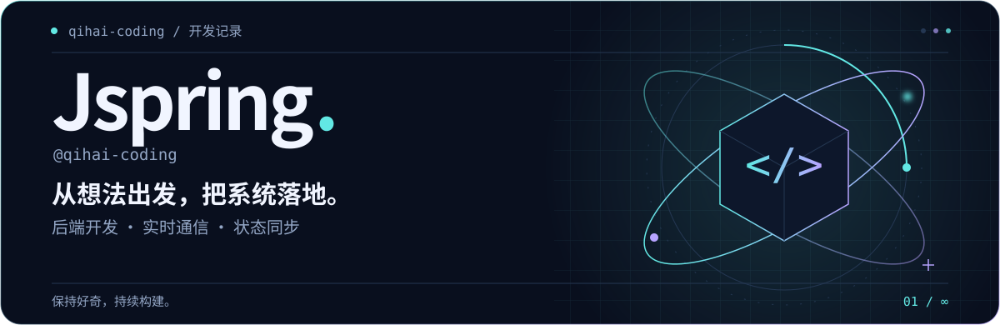

<picture>
  <source media="(max-width: 600px) and (prefers-color-scheme: dark)" srcset="assets/hero-mobile-dark.svg">
  <source media="(max-width: 600px) and (prefers-color-scheme: light)" srcset="assets/hero-mobile-light.svg">
  <source media="(prefers-color-scheme: dark)" srcset="assets/hero-dark.svg">
  <source media="(prefers-color-scheme: light)" srcset="assets/hero-light.svg">
  
</picture>

<b>Go（编程语言）后端开发，关注实时通信与状态同步。</b>

## 公开活动

<picture>
  <source media="(prefers-color-scheme: dark)" srcset="assets/generated/stats-dark.svg">
  <source media="(prefers-color-scheme: light)" srcset="assets/generated/stats-light.svg">
  
</picture>
<picture>
  <source media="(prefers-color-scheme: dark)" srcset="assets/generated/languages-dark.svg">
  <source media="(prefers-color-scheme: light)" srcset="assets/generated/languages-light.svg">
  
</picture>

来自公开可见的数据，提交数按当年统计。语言图展示代码量前六项的相对占比，不代表熟练程度；已排除本主页仓库。

## 贡献轨迹

每一格，记录一次持续构建。

<picture>
  <source media="(prefers-color-scheme: dark)" srcset="assets/generated/snake-dark.svg">
  <source media="(prefers-color-scheme: light)" srcset="assets/generated/snake-light.svg">
  
</picture>

保持好奇，持续构建。

关于数据更新与素材

统计和贡献动画由 GitHub Actions（平台自动工作流）每天北京时间 09:17 尝试更新，也支持手动触发。图片存放在本仓库；生成失败时保留上次成功结果。定时任务可能排队，长期无仓库活动时也可能被平台暂停。

- [查看更新状态](https://github.com/qihai-coding/qihai-coding/actions/workflows/profile.yml)
- [统计生成器](https://github.com/stats-organization/github-readme-stats-action) · [贡献动画生成器](https://github.com/Platane/snk)
- 横幅为本主页定制的 SVG（可缩放矢量图），支持系统的减少动态效果设置。

