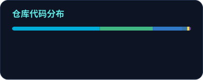

## 公开活动

<picture>
  <source media="(prefers-color-scheme: dark)" srcset="assets/generated/stats-dark.svg">
  <source media="(prefers-color-scheme: light)" srcset="assets/generated/stats-light.svg">
  
</picture>
<picture>
  <source media="(prefers-color-scheme: dark)" srcset="assets/generated/languages-dark.svg">
  <source media="(prefers-color-scheme: light)" srcset="assets/generated/languages-light.svg">
  
</picture>

## 贡献轨迹

<picture>
  <source media="(prefers-color-scheme: dark)" srcset="assets/generated/snake-dark.svg">
  <source media="(prefers-color-scheme: light)" srcset="assets/generated/snake-light.svg">
  
</picture>

关于数据更新与素材

统计和贡献动画由 GitHub Actions（平台自动工作流）每小时整点尝试更新，也支持手动触发。图片存放在本仓库；生成失败时保留上次成功结果。定时任务可能排队，长期无仓库活动时也可能被平台暂停。

- [查看更新状态](https://github.com/qihai-coding/qihai-coding/actions/workflows/profile.yml)
- [统计生成器](https://github.com/stats-organization/github-readme-stats-action) · [贡献动画生成器](https://github.com/Platane/snk)

